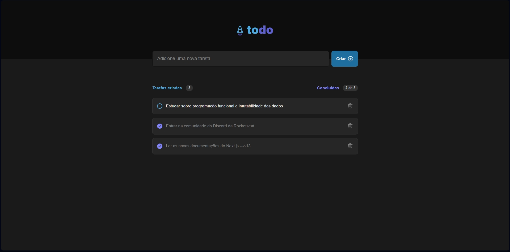

<h1 align="center"> To-do App </h1>

Trabalho exclusivo a assinantes do plano Ignite, promovido pela Rocketseat para ensino de tecnologias WEB.

  <a href="#-tecnologias">Tecnologias</a>&nbsp;&nbsp;&nbsp;|&nbsp;&nbsp;&nbsp;
  <a href="#-projeto">Projeto</a>&nbsp;&nbsp;&nbsp;|&nbsp;&nbsp;&nbsp;
  <a href="#memo-licença">Licença</a>

  

 

## 🚀 Tecnologias

Esse projeto foi desenvolvido com as seguintes tecnologias:

- [Vite](https://vitejs.dev/)
- TypeScript
- CSS Modules
- Local Storage

## 💻 Projeto

O "To-do App" é um aplicativo web desenvolvido em React que permite aos usuários adicionar, remover e salvar tarefas em seus dispositivos locais. Ele oferece uma interface intuitiva e amigável, projetada para facilitar a organização das atividades diárias.

**Principais recursos do To-do App:**

• Adicionar tarefas: Os usuários podem criar novas tarefas, fornecendo um título para cada uma delas;

• Remover tarefas: Os usuários têm a opção de excluir tarefas concluídas ou aquelas que não são mais relevantes;

• Marcar tarefas como concluídas: Os usuários podem marcar as tarefas como concluídas para indicar seu progresso;

• Salvamento no armazenamento local: As tarefas são armazenadas localmente no dispositivo do usuário, permitindo que ele acesse suas tarefas mesmo após fechar e reabrir o aplicativo;

• Interface responsiva: O aplicativo é projetado para se adaptar a diferentes tamanhos de tela, garantindo uma experiência consistente em dispositivos móveis e desktops.

## :memo: Licença

Esse projeto está sob a licença MIT.

---

Feito com ♥ by Gustavo Favero :wave: [Participe da nossa comunidade!](https://discord.gg/rocketseat)
